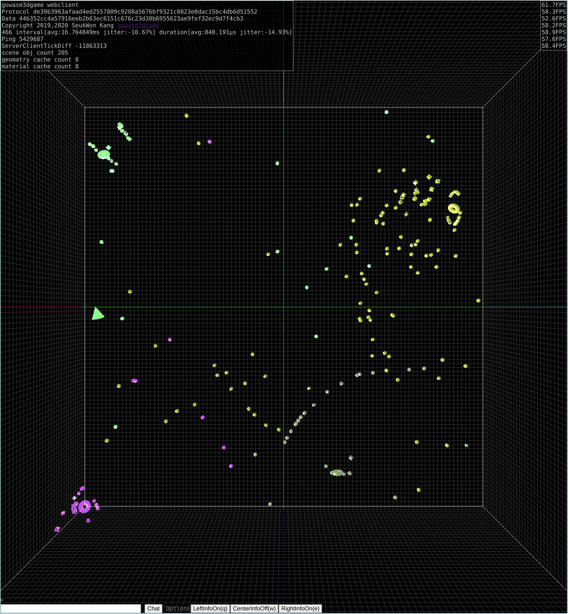
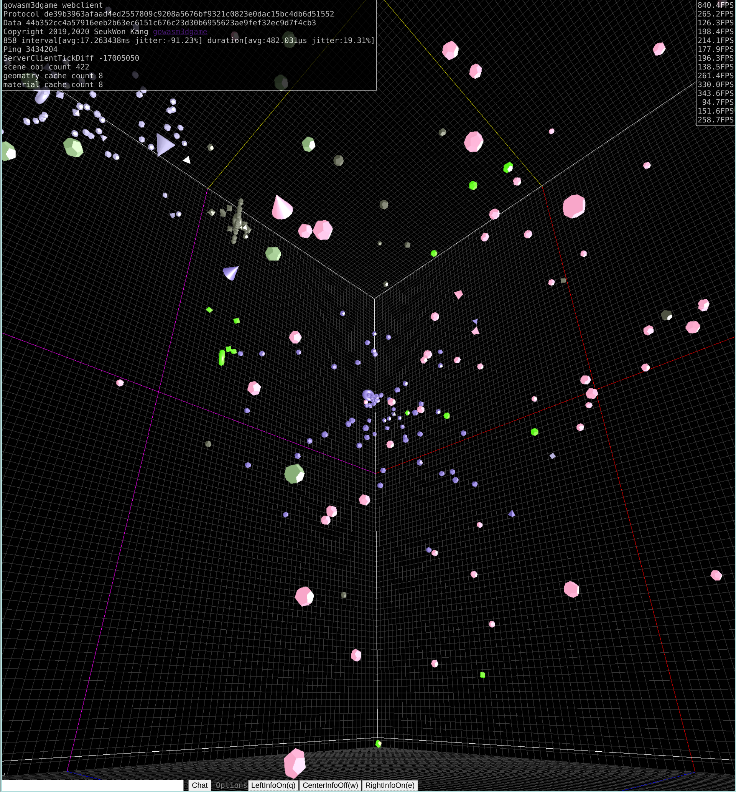

# gowasm3dgame

remake of [go4game](https://github.com/kasworld/go4game)

꽤 예전에 서버 기반 게임 프레임웍 으로 만들었던 go4game을 remake 한 프로젝트 입니다. 

서버 기반 게임 제작을 위한 프레임웍/라이브러리 들인 

[genprotocol](https://github.com/kasworld/genprotocol) 서버 클라이언트가 사용할 프로토콜 생성, 관리 

[argdefault](https://github.com/kasworld/argdefault) : config와 command line arguments 

[prettystring](https://github.com/kasworld/prettystring) : struct 의 string 화 / admin web , debug용 

[genenum](https://github.com/kasworld/genenum) : enum 의 생성, 관리 

[log](https://github.com/kasworld/log) : 전용 log package의 생성, 사용 

[signalhandle](https://github.com/kasworld/signalhandle) : signal을 관리해서 프로그램의 linux 서비스화, start,stop,forcestart,

들을 사용해서 만들어 봤습니다. 

go4game 이 원래 2d 게임? 인 wxgame2를 3d 화 해본 것이었기에 

gowasm3dgame 은 [gowasm2dgame](https://github.com/kasworld/gowasm2dgame) 의 3d 버전에 해당합니다. 

## 서버 실행후 브라우저 서비스 포트 (config에서 수정 가능)

open admin web

    http://localhost:34201/

open client web
    
    http://localhost:34101/

# 여러 종류의 게임(stage)을 지원 

여러 종류의 stage를 하나의 client를 사용해 실행 가능한 형태로 업데이트중 

예제 

2d stage like gowasm2dclient gl

3d stage 
